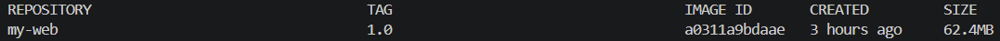
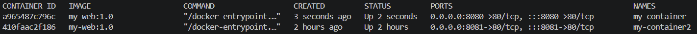
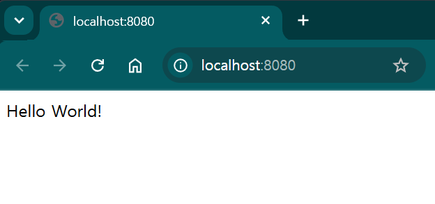
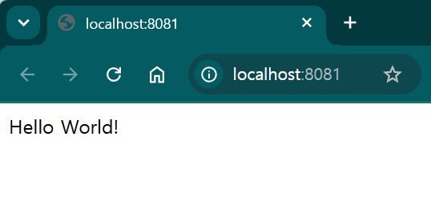
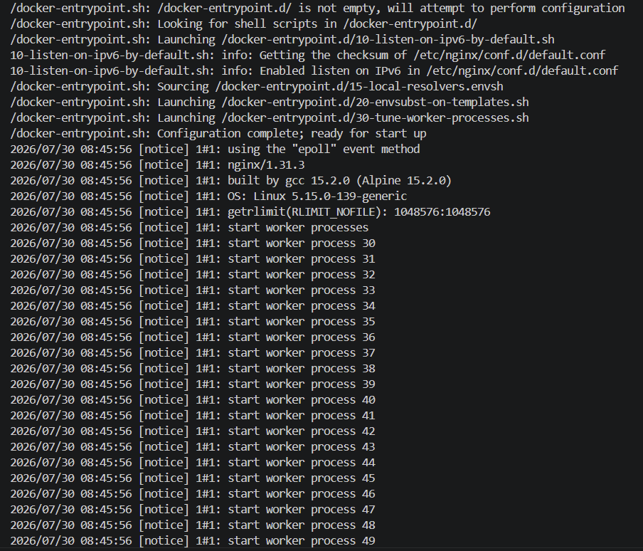

# E1-1. Dev Setup
E1-1. Dev Setup

## 1) Environment
- OS : Ubuntu 20.04.6 LTS
- Shell : 5.0.17(1)-release
- Docker : 23.0.3
- Git : 2.25.1

## 2) Checklist
- [X] (1) Terminal & Folder - Basic terminal operations and folder setup
- [X] (2) Permission - Practice changing file permissions
- [X] (3) Docker Installation - Install and verify Docker
- [X] (4) Docker Build / Execution - Build and run a Docker image using a Dockerfile
- [X] (5) "hello-world" Execution - Run the hello-world container
- [X] (6) Port Mapping & Access - Access containers through port mapping (2 times)
- [ ] (7) Bind Mount - Verify bind mount synchronization
- [ ] (8) Volume - Verify Docker volume persistence
- [ ] (9) Git & VSCode Github - Configure Git and connect VS Code to GitHub

## 3) Details

<details open>
<summary><h3>(1) Terminal & Folder - Basic terminal operations and folder setup</h3></summary>

### pwd - Check Current Directory
현재 작업 중인 디렉토리의 절대경로를 출력하는 명령어
```bash
$ pwd
/root/Dev_Setup
```

### touch - Create Empty File
내용이 없는 빈 파일을 생성하고, `ls -la`로 파일이 정상적으로 만들어졌는지 확인
```bash
$ touch hello_world.txt
$ ls -la
total 20
drwxr-xr-x  3 root root 4096 Jul 29 09:58 .
drwxrwxr-x 39 1001 1001 4096 Jul 29 10:59 ..
drwxr-xr-x  8 root root 4096 Jul 28 06:18 .git
-rw-r--r--  1 root root 2885 Jul 29 11:32 README.md
-rw-r--r--  1 root root   13 Jul 29 09:58 hello_world.txt
```

### nano - Write and Verify File Content
터미널 에디터 nano로 텍스트를 작성/저장하고, `cat`으로 저장된 내용을 확인
```bash
$ nano hello_world.txt
$ cat hello_world.txt
Hello World!
```

### mkdir - Create Directory
새 디렉토리를 생성하고, `ls -la`로 폴더가 추가되었는지 확인
```bash
$ mkdir dev_setup
$ ls -la
total 24
drwxr-xr-x  4 root root 4096 Jul 29 11:36 .
drwxrwxr-x 39 1001 1001 4096 Jul 29 10:59 ..
drwxr-xr-x  8 root root 4096 Jul 28 06:18 .git
-rw-r--r--  1 root root 2760 Jul 29 11:35 README.md
drwxr-xr-x  2 root root 4096 Jul 29 11:36 dev_setup
-rw-r--r--  1 root root   13 Jul 29 09:58 hello_world.txt
```

### cd - Change Directory
생성한 디렉토리로 이동하고, `pwd`로 현재 경로가 바뀌었는지 확인
```bash
$ cd dev_setup
$ pwd
/root/Dev_Setup/dev_setup
```

### cp - Copy File
기존 파일을 복사해 새 파일을 만들고, `ls -la`로 원본과 복사본이 함께 존재하는지 확인
```bash
$ cp hello_world.txt hello_world_cp.txt
$ ls -la
total 28
drwxr-xr-x  4 root root 4096 Jul 29 11:41 .
drwxrwxr-x 39 1001 1001 4096 Jul 29 10:59 ..
drwxr-xr-x  8 root root 4096 Jul 28 06:18 .git
-rw-r--r--  1 root root 3249 Jul 29 11:42 README.md
drwxr-xr-x  2 root root 4096 Jul 29 11:36 dev_setup
-rw-r--r--  1 root root   13 Jul 29 09:58 hello_world.txt
-rw-r--r--  1 root root   13 Jul 29 11:41 hello_world_cp.txt
```

### mv - Move File
`mv`로 파일을 다른 디렉토리로 옮기고, 이동한 위치에서 `ls -la`로 확인
```bash
$ mv ./hello_world_cp.txt ./dev_setup/hello_world_cp.txt
$ cd env_setup
$ ls -la
total 12
drwxr-xr-x 2 root root 4096 Jul 29 11:43 .
drwxr-xr-x 4 root root 4096 Jul 29 11:43 ..
-rw-r--r-- 1 root root   13 Jul 29 11:41 hello_world_cp.txt
```

### mv - Rename File
같은 디렉토리 내에서 `mv`를 사용하면 이동이 아닌 이름 변경으로 동작함을 확인
```bash
$ mv hello_world_cp.txt renamed_hello_world.txt
$ ls -la
total 12
drwxr-xr-x 2 root root 4096 Jul 29 11:46 .
drwxr-xr-x 4 root root 4096 Jul 29 11:43 ..
-rw-r--r-- 1 root root   13 Jul 29 11:41 renamed_hello_world.txt
```

</details>

<details open>
<summary><h3>(2) Permission - Practice changing file permissions</h3></summary>

### chmod - Change File Permission
`chmod 755`로 파일에 실행 권한을 부여하고, 변경 전후 `ls -la` 권한 필드를 비교
```bash
$ ls -la
total 12
drwxr-xr-x 2 root root 4096 Jul 29 11:46 .
drwxr-xr-x 4 root root 4096 Jul 29 11:43 ..
-rw-r--r-- 1 root root   13 Jul 29 11:41 renamed_hello_world.txt
$ chmod 755 renamed_hello_world.txt
$ ls -la
total 12
drwxr-xr-x 2 root root 4096 Jul 29 11:46 .
drwxr-xr-x 4 root root 4096 Jul 29 11:50 ..
-rwxr-xr-x 1 root root   13 Jul 29 11:41 renamed_hello_world.txt
```

### chmod - Change Directory Permission
`chmod 644`로 디렉토리의 실행 권한(`x`)을 제거 - 디렉토리는 `x`가 없으면 내부 진입(`cd`)이 불가능해짐을 보여주는 예시
```bash
$ cd ..
$ ls -la
total 28
drwxr-xr-x  4 root root 4096 Jul 29 11:50 .
drwxrwxr-x 39 1001 1001 4096 Jul 29 10:59 ..
drwxr-xr-x  8 root root 4096 Jul 28 06:18 .git
-rw-r--r--  1 root root 4831 Jul 29 14:54 README.md
drwxr-xr-x  2 root root 4096 Jul 29 11:46 dev_setup
-rw-r--r--  1 root root   13 Jul 29 09:58 hello_world.txt
$ chmod 644 dev_setup
$ ls -la
total 28
drwxr-xr-x  4 root root 4096 Jul 29 11:50 .
drwxrwxr-x 39 1001 1001 4096 Jul 29 10:59 ..
drwxr-xr-x  8 root root 4096 Jul 28 06:18 .git
-rw-r--r--  1 root root 4831 Jul 29 14:54 README.md
drw-r--r--  2 root root 4096 Jul 29 11:46 dev_setup
-rw-r--r--  1 root root   13 Jul 29 09:58 hello_world.txt
```

</details>

<details open>
<summary><h3>(3) Docker Installation - Install and verify Docker</h3></summary>

### docker --version - Verify Installation
설치된 Docker 클라이언트 버전을 출력해 정상 설치 여부를 확인
```bash
$ docker --version
Docker version 23.0.3, build 3e7cbfd
```

### docker info - Check Detailed Info
Docker 데몬의 상세 설정(스토리지 드라이버, 실행 중인 컨테이너/이미지 수, 런타임 등)을 확인
```bash
$ docker info
Client:
 Context:    default
 Debug Mode: false
 Plugins:
  buildx: Docker Buildx (Docker Inc.)
    Version:  v0.10.4
    Path:     /usr/libexec/docker/cli-plugins/docker-buildx
  compose: Docker Compose (Docker Inc.)
    Version:  v2.17.2
    Path:     /usr/libexec/docker/cli-plugins/docker-compose

Server:
 Containers: 73
  Running: 2
  Paused: 0
  Stopped: 71
 Images: 120
 Server Version: 23.0.3
 Storage Driver: overlay2
  Backing Filesystem: extfs
  Supports d_type: true
  Using metacopy: false
  Native Overlay Diff: true
  userxattr: false
 Logging Driver: json-file
 Cgroup Driver: cgroupfs
 Cgroup Version: 1
 Plugins:
  Volume: local
  Network: bridge host ipvlan macvlan null overlay
  Log: awslogs fluentd gcplogs gelf journald json-file local logentries splunk syslog
 Swarm: inactive
 Runtimes: io.containerd.runc.v2 nvidia runc
 Default Runtime: runc
 Init Binary: docker-init
 containerd version: 2806fc1057397dbaeefbea0e4e17bddfbd388f38
 runc version: v1.1.5-0-gf19387a
 init version: de40ad0
 Security Options:
  apparmor
  seccomp
   Profile: builtin
 Kernel Version: 5.15.0-139-generic
 Operating System: Ubuntu 20.04.6 LTS
 OSType: linux
 Architecture: x86_64
 CPUs: 64
 Total Memory: 251.5GiB
 Name: deepcgv-mk3
 ID: XO3U:27VL:HJ4B:2DJW:RWT6:FJHH:7THB:2FTM:KFSB:5GNH:K42Q:QCY6
 Docker Root Dir: /var/lib/docker
 Debug Mode: false
 Username: zinic2
 Registry: https://index.docker.io/v1/
 Experimental: false
 Insecure Registries:
  127.0.0.0/8
 Live Restore Enabled: false
```

</details>

<details open>
<summary><h3>(4) Docker Build / Execution - Build and run a Docker image using a Dockerfile</h3></summary>

### nginx
정적 파일 서빙, 리버스 프록시 등에 널리 쓰이는 경량 웹 서버<br>
여기서는 `nginx:alpine` 이미지를 베이스로 정적 페이지(`site/`)를 서빙하는 커스텀 이미지를 만드는 데 사용

### Dockerfile
nginx 베이스 이미지에 정적 페이지(`site/`)를 담아 이미지를 정의하는 Dockerfile
```dockerfile
FROM nginx:alpine
LABEL org.opencontainers.image.title="my-custom-nginx"
ENV APP_ENV=dev
COPY site/ /usr/share/nginx/html/
```

### docker image build
정적 페이지 파일을 준비하고, 위 Dockerfile을 기반으로 `my-web:1.0` 이미지를 빌드
```bash
$ mkdir site
$ echo "Hello World!" > site/index.html
$ docker build -t my-web:1.0 .
```

### docker images
| | |
|---|---|
| Command | `$ docker images` |
| Result |  |

</details>

<details open>
<summary><h3>(5) "hello-world" Execution - Run the hello-world container</h3></summary>

### docker container run
같은 이미지로 컨테이너 2개를 생성하되, 호스트 포트를 각각 8080/8081로 다르게 매핑하여 동시 실행
```bash
$ docker run -d -p 8080:80 --name my-container my-web:1.0
a965487c796cc8614f70aee1c92b03c15ebaf7529471801152118aada2b8ef89
$ docker run -d -p 8081:80 --name my-container2 my-web:1.0
410faac2f186091ad11660983fc2e5bd977a20355e2d47c0e253fe8a94e7764a
```

### docker ps (process status)
현재 실행 중인 컨테이너 목록과 포트 매핑 상태를 확인

`docker ps` : 실행 중인(running) 컨테이너만 표시<br>
`docker ps -a` : 중지된(stopped) 컨테이너까지 전부 표시 (`-a` : all)<br>


| | |
|---|---|
| Command | `$ docker ps` |
| Result |  |
</details>

<details open>
<summary><h3>(6) Port Mapping & Access - Access containers through port mapping (2 times)</h3></summary>

### Browser Access
두 컨테이너가 각자 매핑된 포트로 정상 응답하는지 브라우저로 접속하여 확인
| port 8080 | port 8081 |
|---|---|
|  |  |

### curl
브라우저 대신 `curl`로 각 포트에 HTTP 요청을 보내 응답 내용을 확인
```bash
$ curl localhost:8080
Hello World!
$ curl http://localhost:8081
Hello World!
```

### docker logs
| | |
|---|---|
| Command | `$ docker logs` |
| Result |  |

### docker stats
```bash 
$ docker stats my-container

```

</details>

<details open>
<summary><h3>(7) Bind Mount - Verify bind mount synchronization</h3></summary>

</details>

<details open>
<summary><h3>(8) Volume - Verify Docker volume persistence</h3></summary>

</details>

<details open>
<summary><h3>(9) Git & VSCode Github - Configure Git and connect VS Code to GitHub</h3></summary>

</details>
